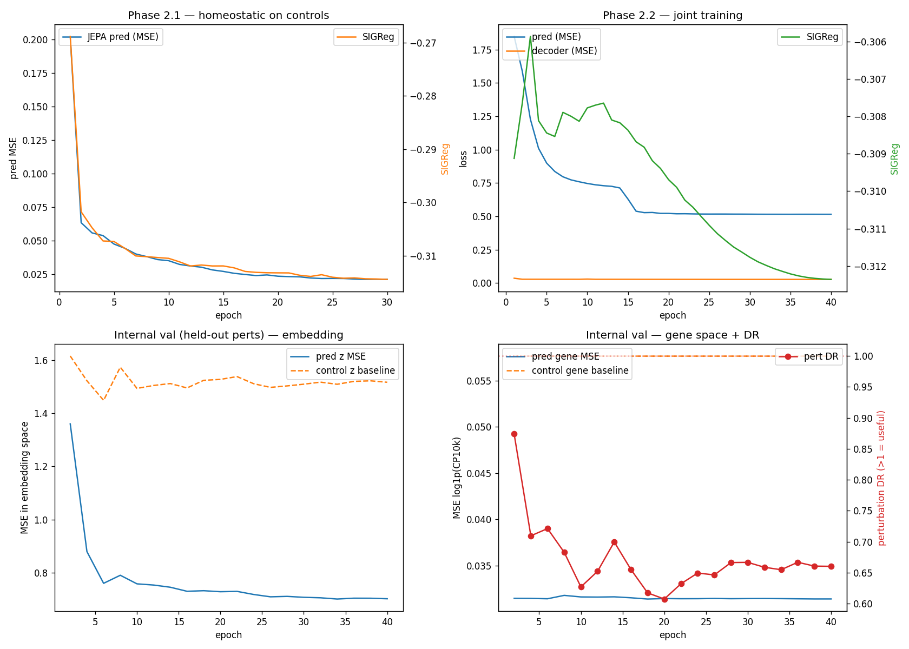

# latent-space

A LeWM-inspired world model for the [Virtual Cell Challenge 2025](https://virtualcellchallenge.org). Treats CRISPRi perturbations as "actions" in a latent world model: given a cell state and a perturbation, predict the post-perturbation transcriptional response.

_Milt, we're gonna need to go ahead and move you downstairs into storage B. We have some new people coming in, and we need all the space we can get. So if you could just go ahead and pack up your stuff and move it down there, that would be terrific, OK?_

## Approach

- **Encoder**: MLP with BatchNorm projector (no L2 norm), gene expression → latent embedding
- **Predictor**: AdaLN-conditioned transformer (zero-init), `(z_cell, perturbation) → z_post`
- **Regularizer**: SIGReg (Sketched Isotropic Gaussian) prevents representation collapse — fully unsupervised, no EMA target encoder
- **Decoder**: latent → gene expression, for VCC submission format

Inspired by:
- [LeWorldModel](https://le-wm.github.io/) (Maes, Le Lidec, LeCun et al. 2026)
- [Principles and Practice of Deep Representation Learning](https://ma-lab-berkeley.github.io/deep-representation-learning-book/) (Ma et al.)
- [A Theory of Generalization in Deep Learning](https://arxiv.org/abs/2605.01172) (Litman & Guo 2026) — for the population-risk gate experiment in Phase 3.

## Status

Phase 3.2 (ESM2 protein-embedding action conditioning + contrastive aux loss) complete. **First real OOD signal**: PDS on the 50-pert validation set rises from chance (0.500) to 0.544. The protein embeddings give the action MLP a transferable signal — genes encoding similar proteins get similar action embeddings by construction, so the model can interpolate to unseen perturbations via sequence-space neighbors. DES (top-K DEG Jaccard) is still flat though, suggesting decoder specialization is still missing.

| | Baseline | Contrastive | ESM2 + Contrastive |
|---|---|---|---|
| PDS | 0.500 (chance) | 0.506 | **0.544** |
| DES | 0.075 | 0.071 | 0.076 |
| pred_emb (val) | 0.012 | 0.181 ⚠️ | 0.057 |



The MNIST proxy work that validated the architecture (3/4 perturbations passing DR>2 with SIGReg + AdaLN + joint training) is preserved in [legacy/](legacy/).

## Run

```bash
# Smoke test the data path (~10s)
python scripts/smoke_test.py

# Tiny smoke test of Phase 2 wiring (~90s)
python scripts/phase2_smoke.py

# Full training (~1h on M4/MPS)
python -m lewm.train

# Score against the validation file
python scripts/score_validation.py
python scripts/plot_training.py
```

## Setup

```bash
uv sync
```

Python 3.12, PyTorch 2.11 with MPS (Apple Silicon).

## Data

VCC 2025 data goes in `data/vcc/`:
- `adata_Training.h5ad` — 221k cells × 18,080 genes, 150 perturbations
- `adata_Validation.h5ad` — 50 perturbations
- `adata_Test.h5ad` — 100 held-out perturbations
