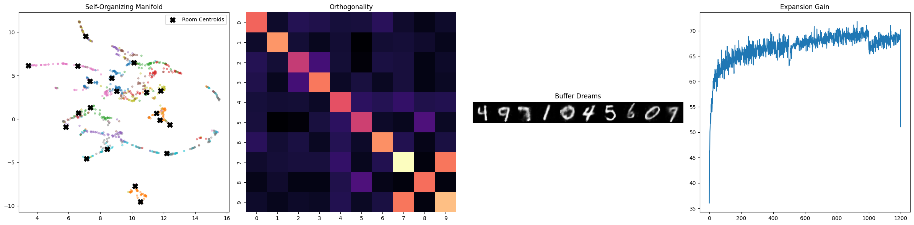
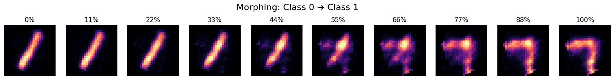

# latent-space

Explorations in latent space learning

_Milt, we're gonna need to go ahead and move you downstairs into storage B. We have some new people coming in, and we need all the space we can get. So if you could just go ahead and pack up your stuff and move it down there, that would be terrific, OK?_

[Principles and Practice of Deep Representation Learning](https://ma-lab-berkeley.github.io/deep-representation-learning-book/) is the primary reference and source of inspiration for all of these experiments.

# MNIST Unsupervised Manifold Discovery (u-CTRL)

[u-ctrl-mnist-replay.py](u-ctrl-mnist-replay.py) implements a purely unsupervised, geometry-driven approach to learning cell-state representations. Using the principle of Maximal Coding Rate Reduction (u-CTRL), the model learns to map high-dimensional input (sensory stream) into incoherent, low-dimensional subspaces on a 128D hypersphere. It learns in a continious fashion by keeping earlier samples in a resevoir to ensure later samples do not distort the already settled latent space by 'replaying' them as memory to keep the initial latent space stable as new signal arrives.

[u-ctl-mnist-gen-replay.py](u-ctl-mnist-gen-replay.py) This module extends the unsupervised manifold discovery (u-CTRL) framework by introducing Generative Replay, replacing the exact historical memory buffer with a purely latent-space buffer.

